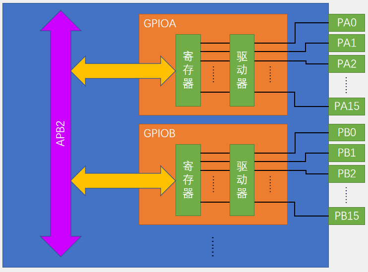
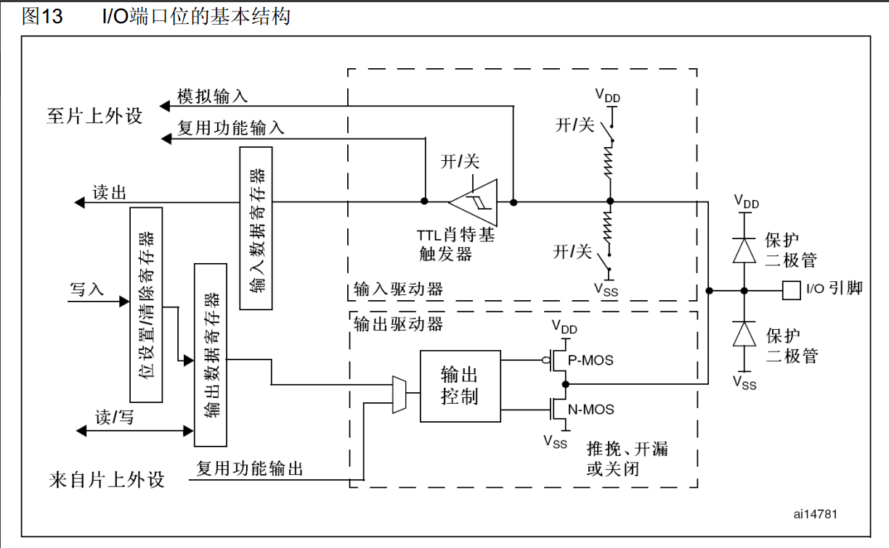

- [传感器电路图](#传感器电路图)
- [获取光敏传感器的数字信号](#获取光敏传感器的数字信号)
- [GPIO](#gpio)
  - [基本结构图](#基本结构图)
  - [编程使用步骤](#编程使用步骤)
  - [pin脚模式配置](#pin脚模式配置)
  - [电路图](#电路图)

### 传感器电路图

### 获取光敏传感器的数字信号 
* DO口的输出：高电平 代表光线较暗，低电平 代表光线较亮  
原因: 光敏电阻接地, 上面串联一个电阻到VCC, 中间的输出电压, 连接到电压比较器(LM393芯片)的V+, 还有一个
可变电阻(R2)作为阈值电压连接到电压比较器的V-, 当光线较暗, 光敏电阻高, V+高, V+大于V-,
所以电压比较器输出高电平, 反之同理.

* C1: 电源滤波
* C2: 输入信号的滤波
* LED2: DO为低电平, 也就是光线较暗, 亮灯

### GPIO
#### 基本结构图

寄存器是32位, 但是只有16个引脚, 所以寄存器高16无效.
#### 编程使用步骤
1. APB2 总线上的外设的时钟使能
2. 初始化GPIOx, 配置pin脚模式
3. 读写GPIOx的pin脚

#### pin脚模式配置
| 模式名称   | 性质   | 特征                        |
| ------ | ---- | ------------------------- |
| 浮空输入   | 数字输入 | 可读取引脚电平，若引脚悬空，则电平不确定      |
| 上拉输入   | 数字输入 | 可读取引脚电平，内部连接上拉电阻，悬空时默认高电平 |
| 下拉输入   | 数字输入 | 可读取引脚电平，内部连接下拉电阻，悬空时默认低电平 |
| 模拟输入   | 模拟输入 | GPIO无效，引脚直接接入内部ADC        |
| 开漏输出   | 数字输出 | 可输出引脚电平，高电平为高阻态，低电平接VSS   |
| 推挽输出   | 数字输出 | 可输出引脚电平，高电平接VDD，低电平接VSS   |
| 复用开漏输出 | 数字输出 | 由片上外设控制，高电平为高阻态，低电平接VSS   |
| 复用推挽输出 | 数字输出 | 由片上外设控制，高电平接VDD，低电平接VSS   |

#### 电路图

图中的肖特基触发器有误, up主说是施密特触发器, 作用是消除输入信号中的噪声和抖动，并产生一个干净的数字输出。

* 详情见 <<STM32F10xxx参考手册（中文）.pdf>> 的 8.1节GPIO功能描述
1. 右边两个二极管, 都是限制电压的
2. 如果是输入模式, 则没有输出部分的电路(也就是下面的一块)
3. 浮空,上拉,下拉输入模式, 就是配置那两个串联的开关, 经过触发器, 就变成了数字输出, 出现在I/O脚上的数据在每个APB2时钟被采样到输入数据寄存器, 对输入数据寄存器的读访问可得到I/O状态
4. 输出模式:
   * 推挽输出: 输出寄存器上的"0", 使得N-MOS导通, 输出低电平, 反之"1"使得P-MOS导通, 输出高电平.
   * 开漏输出: 输出寄存器上的"0", 使得N-MOS导通, 输出低电平. 但是开漏输出没有P-MOS, "1"会将端口置于高阻态(类似开路). 所以其没有驱动高电平的能力, 比如一个高电平发光的二极管, 在开漏输出模式下, 寄存器给"1", 是点不亮二极管的.
