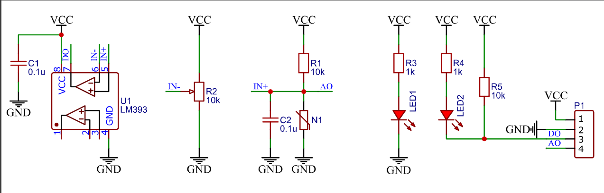

### 电路图

### 获取光敏传感器的数字信号 
* DO口的输出：高电平 代表光线较暗，低电平 代表光线较亮  
原因: 光敏电阻接地, 上面串联一个电阻到VCC, 中间的输出电压, 连接到电压比较器(LM393芯片)的V+, 还有一个
可变电阻(R2)作为阈值电压连接到电压比较器的V-, 当光线较暗, 光敏电阻高, V+高, V+大于V-,
所以电压比较器输出高电平, 反之同理.

* C1: 电源滤波
* C2: 输入信号的滤波
* LED2: DO为低电平, 也就是光线较暗, 亮灯

