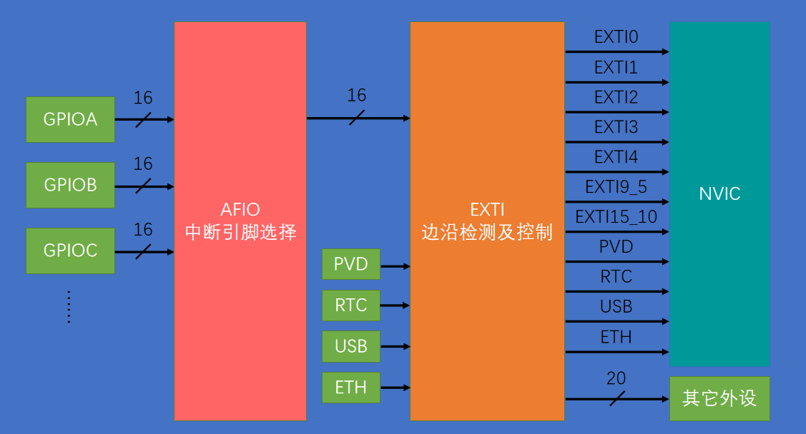
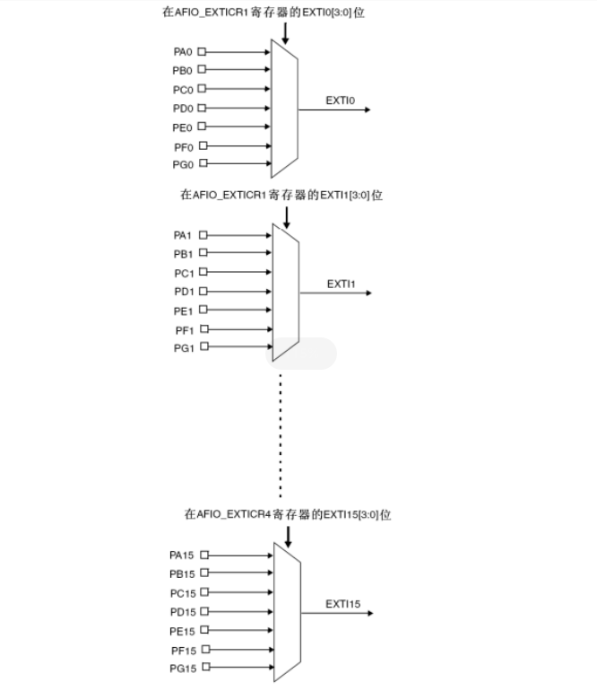

- [EXTI中断流程](#exti中断流程)
- [EXTI中断初始化流程](#exti中断初始化流程)
- [旋转编码器](#旋转编码器)

### EXTI中断流程

1. AFIO主要用于引脚复用功能的选择和重定义, 这里将GPIO引脚设为中断引脚, 比如, 将PA1连上EXTI的中断线EXTI_Line1(图中的EXTI左边输入端口), 这样PA1就是中断引脚了.
2. EXTI有类似20个引脚, 也就是EXTI_Line, GPIO的pin与EXTI_Line是多对一的关系, 
  * 比如 (PA15,PB15...PG15)->Line15, 可以选择某一个GPIOx的pin15作为中断引脚, 假如初始化了EXTI_Line15, 而且是GPIOA的pin15, 连上了EXTI_Line15, 然后配置的下降沿触发, 那么当PA15有一个下降沿, 那么EXTI就会中断发给NVIC, NVIC通过配置的优先级执行中断.   
   * 所以每个GPIOx的pin作为中断引脚时, pin的序号不能相同, 比如用了GPIOA的pin1作为中断引脚, 就不能再绑定GPIOB的pin1作为中断引脚了.
3. 优先级分组配置. 总共有4bit来配置, 有多种选项, 这里选择了NVIC_PriorityGroup_2, 也就是:
  * 2个bit设置抢占优先类型, 也就是抢占优先类型现在有四个等级, 可以把上百种中断源划分到这四个等级, 高等级可以在低等级中断执行的时候中断去高等级中断的代码, 嵌套中断.
  * 2个bit设置subpriority类型, 同样2^2四个等级, 可以把上百种中断源划分到这四个等级, 不是嵌套中断.
4. 对于NVIC的中断选择, 我理解, 如果有一个新产生的中断, NVIC先判断是否嵌套已有的中断(根据抢占式优先级), 如果抢占式优先级相同, 则再根据subpriority优先级排队.

### EXTI中断初始化流程
1. 初始化GPIO, AFIO的时钟
2. 设置GPIO引脚的输入模式
3. AFIO中断引脚选择(GPIO_EXTILineConfig函数), 绑定pin脚和EXIT_Line
4. EXTI配置以及开启EXIT_Linex
5. NVIC优先级分组
6. NVIC开启以及配置中断源的优先级

具体见 hardware\CountSensor.c 的初始化代码.

### 旋转编码器
旋转编码器有两个引脚, 一个是A, 一个是B, 稳定状态下都是高电平, 现在慢慢旋转, 会有一下几个状态(下面A和B只是个代号, 根据旋转方向):
1. 当旋转的时候, 根据旋转方向的不同, 其中一个引脚会先下降为低电平, 随着慢慢旋转维持一段时间, 假设是A, 此时 A=0, B=1 (A触发下降沿)
2. 继续旋转, B也会变成低电平, 同样随着旋转维持一段时间, 此时 A=0, B=0 (B触发下降沿)
3. 继续旋转, A恢复为高电平, 此时 A=1, B=0
4. 继续旋转, B恢复为高电平, 达到稳定状态

在代码中, 旋转编码的A和B都会连接到GPIO作为中断引脚, 当出现状态2的时候, 也就是某个引脚触发下降沿, 并且另一个引脚为0, 那么说明有旋转了, 然后根据谁触发下降沿, 可以区分两个旋转方向.